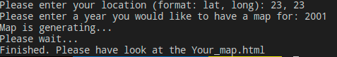
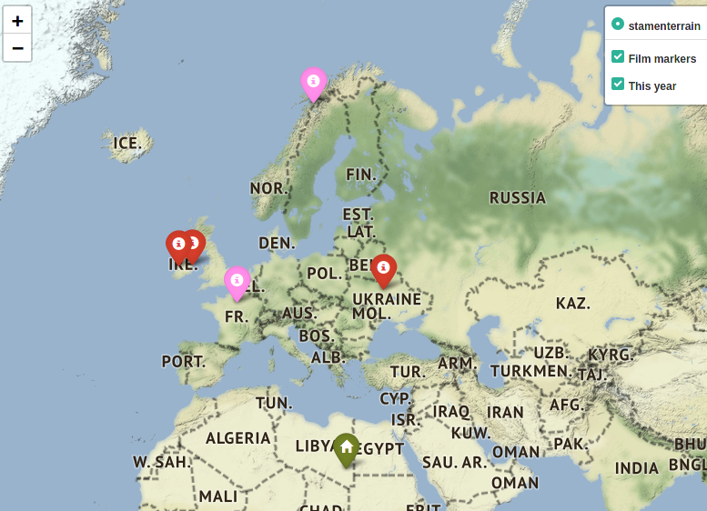

## What it does
To run this program run main.py. You'll see the following:

This is how the map for these data will look like:

Green icon with a house on it shows where user is (according to the coordinates he entered. 
Pink ones show all closest locations for the previous year. Red ones for the year user requested. There're three layers, user may choose what to see on his map.For these data the following html file was generated: "Your_map.html". You may see it as an "Example html". File is automatically created due to folium
